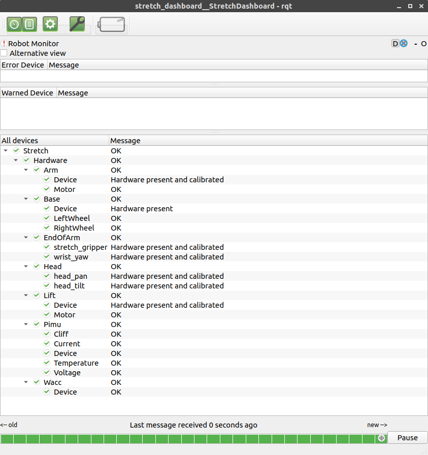

# Stretch Dashboard

 * Gear icon used for calibration
 * Next button used for changing modes
 * Battery shows voltage/current as a tooltip

## To Run
    rosrun stretch_dashboard dashboard

*Note*: The first time you run it you may need to add the `--force-discover` arg to the end of the above command.
