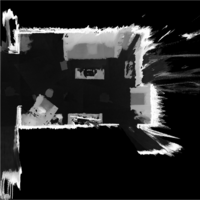
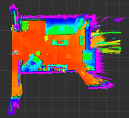
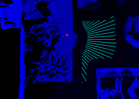
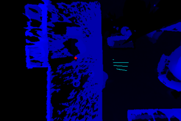
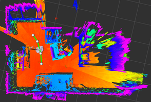
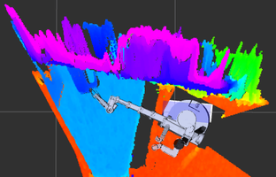

## Overview

*stretch_funmap* is an implementation of Fast Unified Navigation, Manipulation And Planning (FUNMAP). FUNMAP provides navigation, manipulation, and planning capabilities for the Stretch RE1 mobile manipulator. *stretch_funmap* includes examples of efficient ways to take advantage of the Stretch RE1's unique properties. 

Previous commercially-available mobile manipulators have consisted of a serial manipulator (i.e., links connected by rotary joints) placed on a mobile base [1]. Widely used software (e.g., the Robot Operating System (ROS)) [1] typically expects a velocity-controlled mobile base that can be held still while the arm manipulates [3, 4]. 

In contrast, the Stretch RE1's mobile base is integral to manipulation and typically moves throughout a task. It can also perform high-fidelity position control with its mobile base. FUNMAP uses approximate geometric models and computer-vision algorithms to efficiently find plans that take advantage of its prismatic joints (e.g., telescoping arm) and Cartesian structure. In contrast to typical approaches that treat navigation (e.g., ROS Navigation Stack ) and manipulation (e.g., MoveIt! [5, 6]) separately, FUNMAP does both. 

## Getting Started Demo

First, make sure that your Stretch RE1 has clearance to rotate in place and will rotate without straining any cables connected to the trunk. Ideally, you should have the robot untethered.

Next, run the following launch file:

```
roslaunch stretch_funmap mapping.launch
```

Now, you will take a head scan, which will involve the head panning around, the base rotating, and the head panning around again to overcome the blindspot due to the mast.

```
While in the terminal in which you ran roslaunch, press the space bar to initiate the head scan.
```

At this point, you should see a 3D map resulting from the head scan in RViz. You can rotate it around and look at it. It has been created by merging many 3D scans.

If you have the robot untethered, you can now specify a navigation goal for the robot. If the robot finds a navigation plan to the goal, it will attempt to navigate to it. While navigating, it will look down with its 3D camera in an attempt to stop if it detects an obstacle.

```
In RViz, press the "2D Nav Goal" button on the top bar with a magenta arrow icon.
Specify a nearby navigation goal pose on the floor of the map by clicking and drawing a magenta arrow.
```
For this to work, the navigation goal must be in a place that the robot can reach and that the robot has scanned well. For example, the robot will only navigate across floor regions that it has in its map.

If the robot finds a path, you should see green lines connecting white spheres in RViz that display its plan as it attempts to navigate to the goal.

Once the robot has reached the goal, you can take another head scan.

```
While in the terminal, press the space bar to initiate another head scan.
```

The robot should take the head scan and merge it with the previous scans. If all goes well, the merged 3D map will be visible in RViz.

You can also have the robot automatically drive to a place that it thinks is a good place for it to take a head scan in order to map the environment.


```
While in the terminal, press the key with \ and | on it. 
This should work even if caps lock is enabled or the shift key is pressed. 
```

If the robot reached it's goal, then you can now take another head scan. 


```
While in the terminal, press the space bar to initiate another head scan.
```

By repeating this process, you can create a 3D map of the environment. FUNMAP uses images to represent the environment with each pixel value representing the highest observed 3D point at a planar location. By default, all of the merged maps are saved to the following directory:


```
./stretch_user/debug/merged_maps/

```

You can see the image representations by looking at files with the following naming pattern: 


```
./stretch_user/debug/merged_maps/merged_map_DATETIME_mhi_visualization.png
```

You can also click on a reaching goal for the Stretch RE1 by clicking on "Publish Point" in Rviz and then selecting a 3D point on the map. FUNMAP will attempt to generate a navigation and manipulation plan to reach close to the selected 3D location with Stretch's gripper.


```
In RViz, select a reach goal by clicking on "Publish Point" on the top bar with a red map location icon). 
Then, click on a 3D location on the map to specify a reaching target for the robot's gripper.
```

That concludes the demonstration. Have fun with FUNMAP!


## More FUNMAP





FUNMAP represents human environments with Max Height Images (MHIs). An MHI is an image for which each pixel typically represents the height of the robot’s environment. Given a volume of interest (VOI) with its z-axis aligned with gravity, an MHI, I, maps locations to heights. Specifically, I(x,y)=z, where (x,y) represents a discretized planar location within the VOI and z represents the discretized height of the maximum occupied voxel within the VOI at that planar location (see Figure 1 above). 

The placement of the Stretch RE1 3D camera at a human head height enables it to capture MHIs that represent the horizontal surfaces with which humans frequently interact, such as table tops, countertops, and chairs. The orientation of its 3D camera enables the robot to quickly scan an environment to create a room-scale MHI by panning its head at a constant tilt angle. 

In contrast to other environment representations, such as point clouds and 3D mesh models, MHIs support fast, efficient operations through optimized image processing and are compatible with deep learning methods for images. Related representations have primarily been used for navigation, including for legged robots on rough terrain, but have not emphasized elevated surfaces in human environments nor incorporated manipulation [7, 8]. Object grasping systems for bin picking have used related representations, but have only considered small areas with objects and not incorporated navigation [9, 10]. 

During development, we have used FUNMAP to create MHIs for which each pixel represents a 6mm x 6mm region of the environment’s floor and has a height resolution of less than 6mm per unit. This allows a single 2000 x 2000 pixel, 8-bit image to represent a 12m x 12m environment from 10cm below the estimated floor plane to 1.2m above the floor plane, which captures the great majority of open horizontal surfaces in human environments with which people interact. MHIs also have the potential to represent enclosed surfaces (e.g., surfaces in shelves and cabinets) and vertical surfaces (e.g., doors) by defining new VOIs with different orientations and heights, which is a capability that merits future exploration.

For navigation and planning, FUNMAP uses fast distance transforms and morphological operators to efficiently create cost functions for robust optimization-based planning. For example, a high value of a distance transform at a floor location implies that the mobile base will be farther from obstacles. Similarly, a high value of a distance transform for a location on an elevated surface implies that the robot’s end effector will be farther from obstacles. 




Figure 3: Left: The cyan lines represent achievable driving goals on the floor from which the robot can reach the target (red circle) on the table (dark blue). Right: When the target (red circle) is farther back near obstacles on the table (dark blue), the robot can reach the target from fewer locations (cyan lines). 




Figure 4: Left: Example of a piecewise linear navigation plan (green line segments and white spheres) being executed. Right: Example of a successfully executed plan to reach a target location on a table (light blue) while avoiding a wall with shelves (dark blue and purple).

The Stretch RE1’s slender links and Cartesian kinematics support rapid optimization of plans due to the simplified geometry of the robot’s motions. FUNMAP uses piecewise linear paths on the cost image for fast navigation and manipulation planning. 

FUNMAP enables the Stretch RE1 to reach a 3D target position. FUNMAP models the linear motion of the telescoping arm as it extends to reach a target as a line in a manipulation cost image (see Figure 2). FUNMAP uses a navigation cost image and Djikstra’s algorithm with a priority queue to efficiently estimate the cost of navigating to all floor locations (see Figure 3 left). FUNMAP then combines these results to find a minimum cost plan that increases the distance to obstacles and the manipulable workspace of the robot (see Figure 3 right). 


## References

[1] Bostelman, Roger, Tsai Hong, and Jeremy Marvel. "Survey of research for performance measurement of mobile manipulators." Journal of Research of the National Institute of Standards and Technology 121, no. 3 (2016): 342-366.

[2] Quigley, Morgan, Ken Conley, Brian Gerkey, Josh Faust, Tully Foote, Jeremy Leibs, Rob Wheeler, and Andrew Y. Ng. "ROS: an open-source Robot Operating System." In ICRA workshop on open source software, vol. 3, no. 3.2, p. 5. 2009.

[3] Sachin Chitta, Eitan Marder-Eppstein, Wim Meeussen, Vijay Pradeep, Adolfo Rodríguez Tsouroukdissian, et al.. ros_control: A generic and simple control framework for ROS. The Journal of Open Source Software, 2017, 2 (20), pp.456 - 456.

[4] Guimarães, Rodrigo Longhi, André Schneider de Oliveira, João Alberto Fabro, Thiago Becker, and Vinícius Amilgar Brenner. "ROS navigation: Concepts and tutorial." In Robot Operating System (ROS), pp. 121-160. Springer, Cham, 2016.

[5] Chitta, Sachin, Ioan Sucan, and Steve Cousins. "Moveit! [ros topics]." IEEE Robotics & Automation Magazine 19, no. 1 (2012): 18-19.

[6] Chitta, Sachin. "MoveIt!: an introduction." In Robot Operating System (ROS), pp. 3-27. Springer, Cham, 2016.

[7] Fankhauser, Péter, and Marco Hutter. "A universal grid map library: Implementation and use case for rough terrain navigation." In Robot Operating System (ROS), pp. 99-120. Springer, Cham, 2016.

[8] Lu, David V., Dave Hershberger, and William D. Smart. "Layered costmaps for context-sensitive navigation." In 2014 IEEE/RSJ International Conference on Intelligent Robots and Systems, pp. 709-715. IEEE, 2014.

[9] Zeng, Andy, Shuran Song, Johnny Lee, Alberto Rodriguez, and Thomas Funkhouser. "Tossingbot: Learning to throw arbitrary objects with residual physics." arXiv preprint arXiv:1903.11239 (2019).

[10] Zeng, Andy, Shuran Song, Kuan-Ting Yu, Elliott Donlon, Francois R. Hogan, Maria Bauza, Daolin Ma et al. "Robotic pick-and-place of novel objects in clutter with multi-affordance grasping and cross-domain image matching." In 2018 IEEE international conference on robotics and automation (ICRA), pp. 1-8. IEEE, 2018.


## License

For license information, please see the LICENSE files. 
