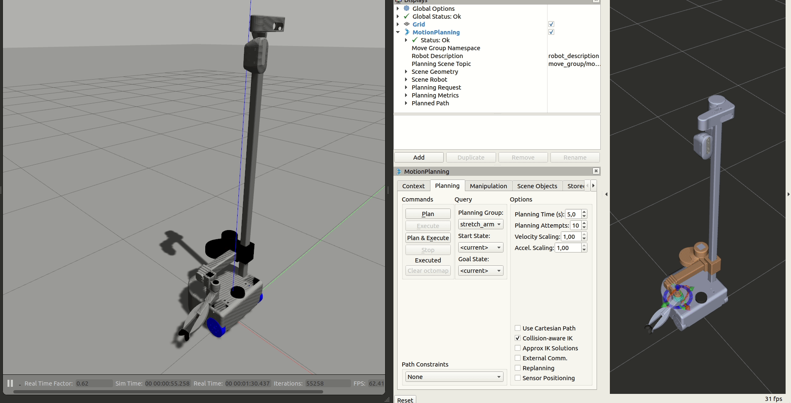

## Overview

*stretch_gazebo* is an implementation of simulating a Stretch robot with [Gazebo](http://gazebosim.org/) simulator.

## Details

The *urdf directory* contains [a xacro file](http://wiki.ros.org/xacro) that extends the capabilities of the original xacro files living in *stretch_description* package to include Gazebo functionality.

The *config* directory contains rviz files and [ros_control](http://wiki.ros.org/ros_control) controller configuration files for various parts of the robot including:

* Base: [diff_drive_controller/DiffDriveController](http://wiki.ros.org/diff_drive_controller)
* Arm: [position_controllers/JointTrajectoryController](http://wiki.ros.org/joint_trajectory_controller)
* Gripper: [position_controllers/JointTrajectoryController](http://wiki.ros.org/joint_trajectory_controller)
* Head: [position_controllers/JointTrajectoryController](http://wiki.ros.org/joint_trajectory_controller)
* Joints: [joint_state_controller/JointStateController](http://wiki.ros.org/joint_state_controller)

The *launch* directory includes two files:

* gazebo.launch: Opens up an empty Gazebo world and spawns the robot loading all the controllers, including all the sensors except Cliff sensors and respeaker.
* teleop_joy.launch: Spawns a joy and teleop_twist_joy instance and remaps *cmd_vel* topics to */stretch_diff_drive_controller/cmd_vel*, which the robot is taking drive commands from. Note that the *teleop_twist_joy* package has a deadman switch by default which disables the drive commands to be published unless it is being pressed. For an Logitech F310 joystick this button is A.

The *script* directory contains a single python file that publishes ground truth odometry of the robot from Gazebo.

## Gazebo Sensors vs Stretch Sensors

|         Sensor        |       Gazebo       |       Stretch      |       Notes       |
|:---------------------:|:------------------:|:------------------:|:-----------------:|
|         LIDAR         | :heavy_check_mark: | :heavy_check_mark: |                   |
|        Base IMU       | :heavy_check_mark: | :heavy_check_mark: |                   |
|  Wrist Accelerometer  | :heavy_check_mark: | :heavy_check_mark: | Modeled as an IMU |
|    Realsense D435i    | :heavy_check_mark: | :heavy_check_mark: |                   |
| Respeaker (Mic Array) |         :x:        | :heavy_check_mark: |                   |
|     Cliff Sensors     |         :x:        | :heavy_check_mark: |                   |

*Notes:* Although there is no microphone in Gazebo, Respeaker can be represented with a ROS node that accesses compputer's microphone. Cliff sensors are not modeled but they can also be represented as 1D LIDAR sensors. See LIDAR definition in *stretch_gazebo.urdf.xacro* file.

## Gazebo - Moveit Controllers vs stretch_core

Actuators are defined as *ros_control* transmission objects in Gazebo using [PositionJointInterfaces](http://docs.ros.org/en/melodic/api/hardware_interface/html/c++/classhardware__interface_1_1PositionJointInterface.html). Moveit is configured to use three different action servers to control the body parts of stretch in Gazebo through the srdf file in *stretch_moveit_config* package. See the section below about moveit for details. Please note that this behaviour is different than *stretch_core* as it works with a single Python interface to control all the joints.

## Setup

Clone stretch_ros and realsense_gazebo_plugin packages to your catkin workspace. Then install dependencies and build the packages, with the following set of commands:

```bash
    cd $CATKIN_WS/src
    git clone https://github.com/hello-robot/stretch_ros
    git clone https://github.com/pal-robotics/realsense_gazebo_plugin
    rosdep install -r --from-paths . --ignore-src --rosdistro melodic -y
    cd $CATKIN_WS
    catkin build
```

## Running Demo

```bash
    # Terminal 1:
    roslaunch stretch_gazebo gazebo.launch rviz:=true
    # Terminal 2:
    roslaunch stretch_gazebo teleop_joy.launch
```

This will launch an Rviz instance that visualizes the sensors and an empty world in Gazebo with Stretch and load all the controllers. Although, the base will be able to move with the joystick comamnds, there joystick won't give joint commands to arm, head or gripper. To move these joints see the next section about *Running Gazebo with MoveIt! and Stretch*.


## Running Gazebo with MoveIt! and Stretch

```bash
    # Terminal 1:
    roslaunch stretch_gazebo gazebo.launch
    # Terminal 2:
    roslaunch stretch_gazebo teleop_joy.launch
    # Terminal 3
    roslaunch stretch_moveit_config demo_gazebo.launch
```

This will launch an Rviz instance that visualizes the joints with markers and an empty world in Gazebo with Stretch and load all the controllers. There are pre-defined positions for each joint group for demonstration purposes. There are three joint groups, namelly *stretch_arm*, *stretch_gripper* and *stretch_head* that can be controlled individually via Motion Planning Rviz plugin. Start and goal positions for joints can be selected similar to [this moveit tutorial](https://ros-planning.github.io/moveit_tutorials/doc/quickstart_in_rviz/quickstart_in_rviz_tutorial.html#choosing-specific-start-goal-states). A few notes to be kept in mind:

* Planning group can be changed via *Planning Group* drop down in Planning tab of Motion Planning Rviz plugin.
* Pre-defined start and goal states can be speciified in *Start State* and *Goal State* drop downs in Planning tab of Motion Planning Rviz plugin.  
* *stretch_gripper* group does not show markers, and is intended to be controlled via the joints tab that is located in the very right of Motion Planning Rviz plugin.
* When planning with *stretch_head* group make sure you select *Approx IK Solutions* in Planning tab of Motion Planning Rviz plugin.


## License

For license information, please see the LICENSE files.
