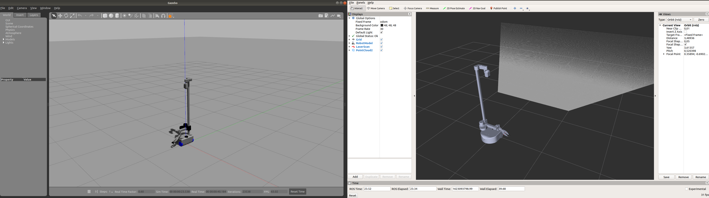

## Overview

*stretch_gazebo* is an implementation of simulating a Stretch robot with [Gazebo](http://gazebosim.org/) simulator.

## Details

The *urdf directory* contains [a xacro file](http://wiki.ros.org/xacro) that extends the capabilities of the original xacro files living in *stretch_description* package to include Gazebo functionality.

The *config* directory contains rviz files and [ros_control](http://wiki.ros.org/ros_control) controller configuration files for various parts of the robot including:

* Base: [diff_drive_controller/DiffDriveController](http://wiki.ros.org/diff_drive_controller)
* Arm: [position_controllers/JointTrajectoryController](http://wiki.ros.org/joint_trajectory_controller)
* Gripper: [position_controllers/JointTrajectoryController](http://wiki.ros.org/joint_trajectory_controller)
* Head: [position_controllers/JointTrajectoryController](http://wiki.ros.org/joint_trajectory_controller)
* Joints: [joint_state_controller/JointStateController](http://wiki.ros.org/joint_state_controller)

The *launch* directory includes two files:

* gazebo.launch: Opens up an empty Gazebo world and spawns the robot loading all the controllers, including all the sensors except Cliff sensors and respeaker.

The *script* directory contains a single python file that publishes ground truth odometry of the robot from Gazebo.

## Running Gazebo

```bash
# Terminal 1:
roslaunch stretch_gazebo gazebo.launch rviz:=true
# Terminal 2:
roslaunch stretch_core teleop_twist.launch twist_topic:=/stretch_diff_drive_controller/cmd_vel linear:=1.0 angular:=2.0 teleop_type:=keyboard # or use teleop_type:=joystick if you have a controller
```

This will launch an Rviz instance that visualizes the sensors and an empty world in Gazebo with Stretch and load all the controllers. Although, the base will be able to move with the joystick commands, the joystick won't give joint commands to arm, head or gripper. To move these joints see the next section about *Running Gazebo with MoveIt! and Stretch*.



### Running Gazebo with Keyboard Teleop node
*keyboard_teleop_gazebo* : node that provides a keyboard interface to control the robot's joints within the gazebo simulation.

```bash
# Terminal 1:
roslaunch stretch_gazebo gazebo.launch rviz:=true
# Terminal 2:
rosrun stretch_gazebo keyboard_teleop_gazebo
```

### Running Gazebo with Dex Wrist

```bash
# Terminal 1:
roslaunch stretch_gazebo gazebo.launch dex_wrist:=true rviz:=true
```

## Differences in Gazebo vs Stretch

The simulated Stretch differs from the robot in the following ways.

### Gazebo Sensors vs Stretch Sensors

|         Sensor        |       Gazebo       |       Stretch      |       Notes       |
|:---------------------:|:------------------:|:------------------:|:-----------------:|
|         LIDAR         | :heavy_check_mark: | :heavy_check_mark: |                   |
|        Base IMU       | :heavy_check_mark: | :heavy_check_mark: |                   |
|  Wrist Accelerometer  | :heavy_check_mark: | :heavy_check_mark: | Modeled as an IMU |
|    Realsense D435i    | :heavy_check_mark: | :heavy_check_mark: |                   |
| Respeaker (Mic Array) |         :x:        | :heavy_check_mark: |                   |
|     Cliff Sensors     |         :x:        | :heavy_check_mark: |                   |

*Notes:* Although there is no microphone in Gazebo, Respeaker can be represented with a ROS node that accesses compputer's microphone. Cliff sensors are not modeled but they can also be represented as 1D LIDAR sensors. See LIDAR definition in *stretch_gazebo.urdf.xacro* file.

### ROS_Control Controllers vs stretch_core

Actuators are defined as *ros_control* transmission objects in Gazebo using [PositionJointInterfaces](http://docs.ros.org/en/melodic/api/hardware_interface/html/c++/classhardware__interface_1_1PositionJointInterface.html). MoveIt is configured to use three different action servers to control the body parts of stretch in Gazebo through the srdf file in *stretch_moveit_config* package. See the section above about MoveIt for details. Please note that this behavior is different than *stretch_core* as it works with a single Python interface to control all the joints.

### Uncalibrated XACRO vs Calibrated URDF

We provide [stretch_calibration](../stretch_calibration/README.md) to generate a calibrated URDF that is unique to each robot. The calibrated URDF is generated from the nominal description of Stretch, the xacro files that live in [stretch_description](../stretch_description/README.md). The simulated Stretch is generated from the gazebo xacro description in the *urdf directory* and is not calibrated.

## License

For license information, please see the LICENSE files.
